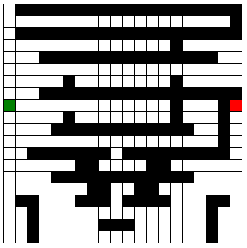
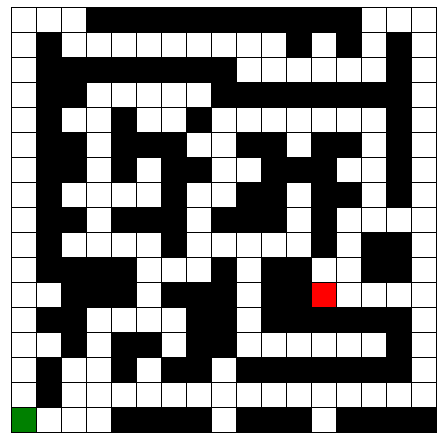
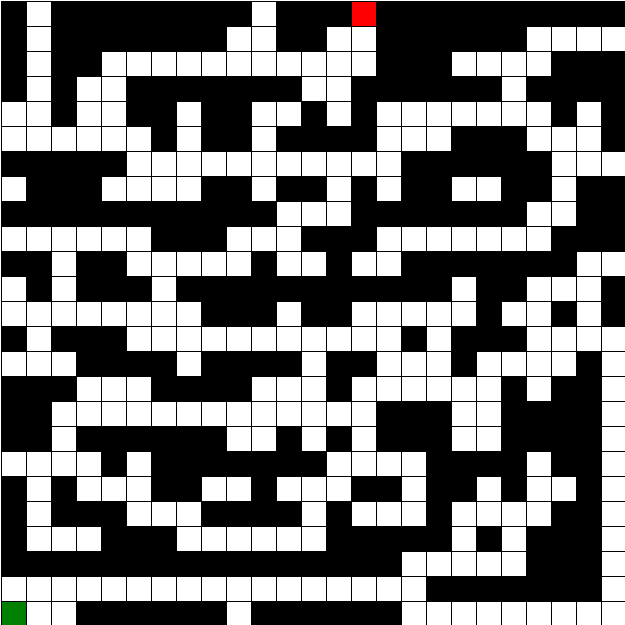
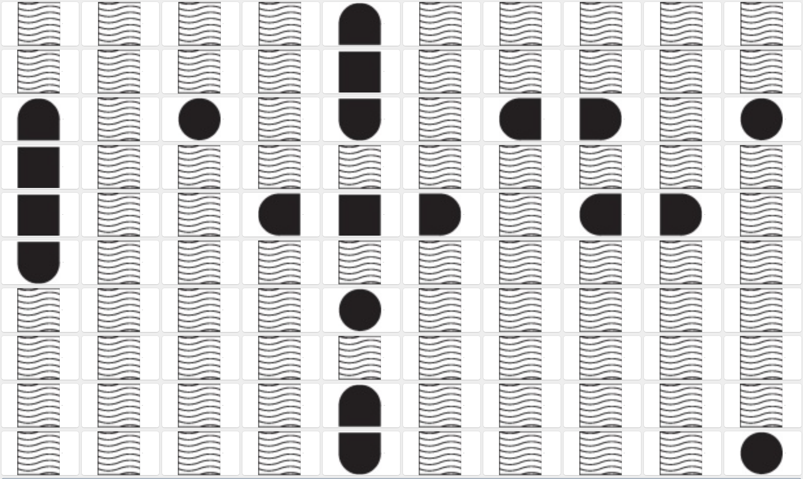

# Relazione progetti Prolog e Clingo

Andrea Cacioli
Matricola: 914501

[TOC]

## Prolog

In questa prima fase si é sperimentato l'utilizzo del paradigma di programmazione logica in prolog. Il progetto consiste nello sviluppo di un codice in grado di risolvere il problema del labirinto attraverso diverse strategie di ricerca nello spazio degli stati.

### File prodotti (prolog)

#### File principali

- astar: file di definizione della strategia di ricerca informata A*
- azioni: file di definizione azioni possibili e applicabilitá di esse
- bfs: file di definizione strategia blind di ricerca in ampiezza
- heuristic: file di definizione di eventuali euristiche per la ricerca informata
- profonditá: file di definizione della strategia di ricerca blind in profonditá e iterative deepening.

#### Labirinti

- lab1.pl: file creato in classe di test 10x10
- zigzag15x15.pl: labirinto in figura


- hard20x20.pl: labirinto in figura



- hard15x15.pl: labirinto pensato per mandare in confusione A*


- easy17x17.pl: labirinto classico con molti blocchi



- easy25x25.pl: labirinto classico con molti blocchi



- MultipleExits.pl: labirinto con numerose uscite


#### File Benchmarker

Tale file serve solamente a provare le varie strategie su un labirinto precedentemente specificato.

#### Utilizzo

Per far partire le seguenti strategie si carichi tramite consultazione il labirinto che si desidera testare e si proceda come segue:

1. Ricerca Iterative Deepening
    - Caricare i file ['prof.pl']
    - Dimostrare con prolog il fatto start.

2. Ricerca in profonditá
    - Caricare i file ['prof.pl']
    - asserire una profonditá massima n grande a piacere con assert(maxProf(n))
    - Dimostrare con prolog i fatti prova(Cammino), write(Cammino).

3. Ricerca in ampiezza
    - Caricare i file ['bfs.pl']
    - Dimostrare con prolog il fatto start.

4. Ricerca con A*
    - Caricare i file ['astar.pl']
    - Dimostrare con prolog il fatto start.

#### Performance

Tabella dei test effettuati:
I = Instantaneous (probably 10 to 20 milliseconds)
DNF = Did Not Finish

| Labirinto      | A*      | Ampiezza | Iterative Deepening (MaxProf) | Profonditá |
| -------------- | ------- | -------- | ----------------------------- | ---------- |
| lab1           | I       | I        | I (16)                        | I          |
| zigzag15x15    | I       | I        | I (126)                       | I          |
| easy17x17      | I       | I        | I (25)                        | I          |
| easy25x25      | I       | 390 ms   | 51.313 s (98)                 | 15 ms      |
| hard15x15      | I       | 47       | 22.297 s (28)                 | I          |
| hard20x20      | 1.906 s | 67.188 s | DNF (> 3h) (33)               | 6.078 s    |
| Multiple Exits | 5 ms    | 27.449 s | 612.5 s (27)                  | 1 ms       |

##### Osservazioni

- La strategia in profonditá é molto buona quando non deve trovare soluzioni ottime, infatti ha fatto molto bene in tutti i labirinti, tuttavia la lunghezza del cammino in hard20x20 era di ben 87 contro i 37 della strategia in ampiezza.
- Non sono riuscito a disegnare un labirinto che mettesse in difficoltá seriamente A*
- Iterative Deepening, sebbene trovi sempre la soluzione ottima in termini di numero di passi, é la piú lenta in termini di tempo di esecuzione.
- In generale i labirinti con pochi muri risultano piú dispendiosi da calcolare per le strategie che trovano una soluzione ottima, eccetto A* grazie alla sua euristica.
- Labirinti che all'apparenza sembrano molto difficili da risolvere per noi esseri umani sono in realtá molto piú semplici per la macchina perché diminuiamo il branching factor dell'albero di ricerca nello spazio degli stati.

## Clingo

Nel progetto di Asp é richiesto di scrivere un programma clingo in grado di generare un calendario per una competizione sportiva.
Tale calendario é esprimibile in linguaggio clingo tramite una serie di vincoli di integritá e di aggregati.

### File prodotti (clingo)

I file del progetto sono diversi ma di due tipi principali:

1. campionato_vincoli.cl: il file contenente tutti i vincoli che prescindono dal numero di squadre presenti nel campionato.
2. campionato[X].cl: diversi file in cui al posto di X c'é il numero di squadre del campionato e che contiene i vincoli che cambiano in funzione del numero di squadre.

### Utilizzo

Per far funzionare il programma e avere in output un campionato su di un file di testo chiamato **out.txt** utilizzando **12 thread** per il calcolo bisogna eseguire il seguente comando:

```sh
clingo ./campionato_vincoli.cl ./campionato[X].cl  -t 12 > out.txt 
```

Rimpiazzando [X] con il numero di squadre di cui si vuole il calendario.

### Output

L'output é una lista di predicati assegna con arietá 3 in cui il primo argomento é la giornata di riferimento della partita, il secondo é la squadra di casa e il terzo é la squadra in trasferta.
Siccome l'output puó essere spesso confusionario é opportuno processarlo con un editor di testo e il risultato di un campionato da 14 squadre é il seguente:

```text
assegna(1,bulls,celtics)
assegna(1,cavaliers,nets)
assegna(1,seventysixers,mavericks)
assegna(1,warriors,lakers)
assegna(1,clippers,rockets)
assegna(1,pistons,pacers)
assegna(1,heat,nuggets)
assegna(2,pacers,celtics)
assegna(2,bulls,seventysixers)
assegna(2,heat,cavaliers)
assegna(2,mavericks,pistons)
assegna(2,warriors,clippers)
assegna(2,lakers,rockets)
assegna(2,nets,nuggets)
...
assegna(26,celtics,bulls)
assegna(26,pistons,mavericks)
assegna(26,lakers,warriors)
assegna(26,cavaliers,clippers)
assegna(26,nuggets,rockets)
assegna(26,nets,pacers)
assegna(26,seventysixers,heat)
```

I 3 puntini indicano che ci sono le altre giornate nel file di output ma che non le ho riportate qui per non rendere la relazione troppo lunga.

### Predicati

I predicati che sono stati utilizzati sono i seguenti:

- assegna/3:
    1. Giornata di campionato
    2. Squadra di casa
    3. Squadra in trasferta
- squadra/1:
    1. Una squadra del campionato
- giornata/1:
    1. Una giornata del campionato
- citta/2:
    1. Una squadra del campionato
    2. La sua cittá di afferenza

### Performance

Una delle maggiori difficotá é stata quella di riuscire a far terminare il programma con un elevato numero di squadre pur rispettando tutti i vincoli. Questo é particolarmente difficile in questo paradigma poiché non si specifica come ottenere la soluzione ma come deve essere tale soluzione: in pieno rispetto del **paradigma dichiarativo**.

Tuttavia sono state fatte delle misurazioni di tempi impiegati dal programma in utilizzando diverse formulazioni per gli stessi vincoli.

#### Tentativi

Un **primo tentativo** é stato quello di rimuovere l'aggregato che obbliga lo **svolgimento di tutte le partite in qualche giornata**:

```clingo
1 { assegna(G, Squadra1, Squadra2): giornata(G)  } 1 :- partita(Squadra1,Squadra2).
```

Con il seguente predicato e relativo vincolo.

```clingo
% Vincolo alternativo ad aggregato (non posso assegnare a giornate diverse la stessa partita)
:- assegna(G1, Squadra1, Squadra2), assegna(G2, Squadra1, Squadra2), G1 <> G2.
```

Purtroppo tale cambiamento ha solamente rallentato l'esecuzione del programma.

Il **secondo tentativo** per velocizzare il programma cerca metodi alternativi per risolvere il problema di **non avere la stessa squadra che fa partite diverse nella stessa giornata**

Metodo 1:

```clingo
:- assegna(G, Squadra1, Squadra2), assegna(G, Squadra1, Squadra3), Squadra2 != Squadra3.
:- assegna(G, Squadra2, Squadra1), assegna(G, Squadra3, Squadra1), Squadra2 != Squadra3.
:- assegna(G, Squadra2, Squadra1), assegna(G, Squadra1, Squadra3), Squadra2 != Squadra3.
```

Metodo 2:

```clingo
gioca(G, A) :- assegna(G,A,_).
gioca(G, A) :- assegna(G,_,A).
:- squadra(A), giornata(G), not gioca(G,A).
```

Il metodo 2, sebbene piú leggibile, é notevolmente piú lento del metodo 1. Pertanto si é preferito il metodo 1.

**Importante**: il metodo 1 non é esaustivo per tutti i casi possibili di partite della stessa squadra nella stessa giornata, per esempio assegna(G,A,B) e assegna(G,B,A) non é impedito, tuttavia esiste un altro vincolo che obblga ad avere andata e ritorno rispettivamente nella prima metá di campionato e nella seconda metá.

#### Tempo

Il tempo di esecuzione sulla mia macchina é il seguente
DNF = Did Not Finish

| Dimensione Campionato | Numero squadre che condividono lo stadio | numero di Thread | Tempo di Esecuzione |
| --------------------- | ---------------------------------------- | ---------------- | ------------------- |
| 10 squadre            | 2                                        | 1                | .01 s               |
| 12 squadre            | 2                                        | 1                | 11 s                |
| 12 squadre            | 4                                        | 1                | 58 s                |
| 14 squadre            | 2                                        | 1                | 2 min 33 s          |
| 14 squadre            | 2                                        | 12               | 6 s                 |
| 16 squadre            | 2                                        | 12               | 1 min 12 sec        |
| 18 squadre            | 2                                        | 12               | 21 min 19 sec       |
| 20 squadre            | 2                                        | 12               | DNF (> 14h)         |

# Relazione progetto CLIPS

Andrea Cacioli
Matricola: 914501

## Sistema Esperto per la battaglia navale in solitario

In questo progetto é stato richiesto di scrivere un sistema esperto per la risoluzione del gioco della battaglia navale in **CLIPS**.

Il gioco si gioca su una scacchiera 9x9 e all'inizio sono noti dei fatti relativi al numero di posizioni occupate da una nave in una riga e in una colonna (fatti k-per-row k-per-column).

Inoltre in altre situazioni é possibile avere dei fatti noti a priori relativi alla posizione occupata da un pezzo di nave.

**Attenzione**: Il progetto é stato realizzato prima delle nuove versioni comunicate via mail che cambiavano l'environment. Pertanto sono presenti regole che asseriscono fatti relativi alle **misfire**.

### Strategia

La strategia del mio sistema é semplice:

1. Per prima cosa se si é certi che in qualche posizione ci sia un pezzo di nave, fare una guess in tale cella
2. Se si é certi che un pezzo di nave possa eventualmente avere un pezzo in due posizioni possibili ma non in tutte e due, allora si fa una fire in una delle due posizioni e se ho trovato il pezzo di nave, non si fa la fire anche sul secondo.
3. Se non si ricade in nessuna delle due categorie precedenti si fa una fire nel punto con maggiore probabilitá di contenere un pezzo di nave.
4. Se non si dispone piú di fire ma si dispone ancora di guess, allora si fa una guess su tutte le celle con piú alta probabilitá di contenere una nave.

### Fatti

I fatti (non ordinati) relativi al contenuto di una cella sono i seguenti e contengono le coordinate della cella di cui si parla:

- cell se una cella esiste
- guessed: se si é fatto un guess su una cella
- fired: se si é fatto un fire su una cella
- water: se si é certi che tale cella contenga acqua

### Strutture di controllo

Sono state pensate delle strutture di controllo gestite come delle code. In pratica quando si asserisce un fatto, questo viene automaticamente utilizzato per fare una guess o una fire.

Fatti:

- plausible-cell: Fatto che se asserito, il sistema fará una fire su tale cella
- guess-queue: Fatto che se asserito, il sistema fará una guess su tale cella
  
Regole:

- guess-from-queue: Regola con salience alta che esegue la guess
- information-already-used: se si é giá fatta una guess in tale cella, la si toglie dalla coda senza farne un'altra.
- fire-plausible-cell: esegue una fire sulla cella che potrebbe contenere una nave.
- clean-water: rimuove l'informazione relativa all'acqua se essa é fuori dalla scacchiera
- no-fire-on-fired: lo stesso di information-already-used ma per le fire

#### One Or The Other

Spesso capita che ci si trovi in delle situazioni in cui si é indecisi se la barca possa avere un pezzo in due posizioni, tuttavia si sa certamente che non puó avere entrambe le posizioni occupate.
In tale situazione si utilizza il fatto one-or-the-other che viene asserito insieme ai fatti plausible-cell che causeranno le fire.
Se una fire va a buon fine in una delle due celle, si rimuove sia il fatto one-or-the-other sia l'altra cella (che a questo punto non é piú plausibile).

### Probabilitá

**(KNOWN)** Siano $K_r$ e $K_c$ il conteggio delle celle che sono note contenere qualcosa rispettivamente nella riga $i$ e nella colonna $j$.

**(BOATS)** Siano $B_r$ e $B_c$ il conteggio delle celle che sono note contenere dei pezzi di barca rispettivamente nella riga $i$ e nella colonna $j$.

**(DISCOVERED)** Siano $D_r$ e $D_c$ il conteggio delle celle che sono giá state scoperte contenere dei pezzi di barca precedentemente dal programma rispettivamente nella riga $i$ e nella colonna $j$.

Posso calcolare la probabilitá usando la definizione classica (casi favorevoli / casi totali)
La probabilitá della cella $C_{i,j}$ di contenere una barca é la seguente:

$$
\bold{P}(C_{i,j} \neq \text{water}) = \frac{(B_r + B_C) - (D_r + D_c)}{19 - (K_r + K_c)}
$$

\pagebreak

#### Esempio

B = Barca nota
W = Acqua nota

| 0         | 1   | 2   | 3 (k = 3) | 4   | 5   | 6   | 7   | 8   | 9   |
| --------- | --- | --- | --------- | --- | --- | --- | --- | --- | --- |
| 0         |     |     |           |     |     |     |     |     |     |
| 1         |     |     |           |     |     |     |     |     |     |
| 2         |     |     | W         |     |     |     |     |     |     |
| 3         |     |     |           |     |     |     |     |     |     |
| 4         |     |     | B         |     |     |     |     |     |     |
| 5 (k = 3) |     |     | $C_{5,2}$ |     | B   |     | W   |     |     |
| 6         |     |     |           |     |     |     |     |     |     |
| 7         |     |     |           |     |     |     |     |     |     |
| 8         |     |     | W         |     |     |     |     |     |     |
| 9         |     |     |           |     |     |     |     |     |     |

In questo esempio abbiamo che la probabilitá di $C_{5,2}$ di contenere una barca é:

$$
\bold{P}(C_{5,2} \neq \text{water}) = \frac{(3 + 3) - (1 + 1)}{19 - (2 + 3)} = \frac{4}{14} = .2857 = 28.57\%
$$

Una volta determinata la probabilitá, se il sistema non ha altre informazioni note, esso procede a fare delle fire sulla cella piú probabile.

Se non dispone di fire, il sistema utilizza tutte le guess su ogni cella piú probabile.

### Performance

Evidenzio ora le prove che ho fatto: le scacchiere utilizzate e i relativi punteggi che il sistema esperto ha totalizzato su di esse.

Scacchiera 1 (mapEnvironment1.clp): **Punteggio 280**


Scacchiera 2 (NoInformation.clp): **Punteggio 245**



Scacchiera 3 (Scattered.clp): **Punteggio 20**


### Considerazioni

- Come si puó vedere la strategia é **molto buona se si dispongono informazioni sulla posizione delle barche**.
- Il meccanismo della probabilitá **funziona bene su mappe in cui molte celle di una stessa riga o colonna sono occupate da barche**.
- Utilizzare la probabilitá **non fa molti punti se le navi sono molto ben spaziate tra loro** perché i valori di k-per-row e k-per-column sono simili tra loro.

# Relazione progetto SOAR

Andrea Cacioli
Matricola: 914501

## Escape Game

In questo progetto é stato necessario utilizzare l'architettura cognitiva **SOAR** per modellare il comportamento di un agente rinchiuso in una stanza con l'obiettivo di scappare attraverso una finestra. Tale gente ha a disposizione  diversi oggetti di cui però all'inizio non so il funzionamento, tuttavia attraverso un meccanismo di **Reinforcement Learning** l'agente imparerá a fare le giuste combinazioni di oggetti al fine di creare una fionda, rompere la finestra e scappare.

## Modellazione della conoscenza

Le assunzioni che sono state fatte (per non rendere troppo complicato il progetto modellando anche la fisica del mondo) sono le seguenti:

- Il robot puó in ogni momento trovarsi in una di quattro posizioni: **nord, sud, est, ovest**.
- Il robot sa fin da subito dove si trova la **finestra** e dove si trovano i **tronchi**. (Si puó immaginare che la stanza sia sufficientemente piccola da avere tutto a vista).
- Il robot sa che puó **combinare** gli elementi che trova (molla, rametto, sassolini).
- Il robot sa che puó sparare alla finestra in due modi diversi:
  - Ai bordi
  - Al centro
- Il robot **non** sa né quale sia la migliore combinazione di oggetti che gli permetterá di avere una fionda, né quale sia il punto giusto da sparare quando si spara alla finestra.
- Il robot sa qual é il movimento migliore da fare nelle varie situazioni.

## Risoluzione Impasse

L'impasse é risolta in modi diversi a seconda di cosa sta succedendo intorno al robot.

### Impasse per il movimento

- L'operatore che ti muove verso i tronchi é sempre il migliore quando si hanno i tronchi.
- L'operatore che ti muove verso la finestra é sempre il migliore quando si hanno i tronchi ma la finestra non é ancora rotta.

### Impasse per la combinazione di oggetti

Qui la scelta dell'operatore all'inizio é casuale (numeric indifferent) dopodiché la scelta é presa grazie al reinforcement learning.

### Impasse per lo sparo alla finestra

Qui la scelta dell'operatore all'inizio é casuale (numeric indifferent) dopodiché la scelta é presa grazie al reinforcement learning.

## Ulteriori Operatori

Il robot dispone di altri due operatori: uno per costruire la torre e uno per arrampicarsi sulla torre e scappare.

## Perfomance

In questa sezione verrá analizzato il numero di passi medio che impiega l'agente a imparare i rinforzi.

| Valore di epsilon | Numero di Esecuzioni | Valore di Stabilitá |
| ----------------- | -------------------- | ------------------- |
| default (0.1)     | 1                    | 8                   |
| 0.3               | 2                    | 8                   |
| 0.5               | 2                    | 8                   |
| 0.9               | 3                    | 8                   |

## Osservazioni

**Attenzione**: Sotto il campo "Numero di Esecuzioni" é inteso come caso peggiore perché in realtá spesso se l'agente indovina subito l'operazione giusta, esso tende a continuare per quella strada anche con valori di epsilon piú alti (forse perché ha anche un rinforzo negativo quando sbaglia).

### Lavoro futuro

Sarebbe interessante vedere fino a dove si puó spingere il meccanismo del RL provando a eliminare ogni tipo di conoscenza del mondo eccetto che per i meccanismi di RL per vedere come un agente complesso impara in maniera completamente behaviouristica.

Sarebbe interessante capire se tali "pesi" imparati possono essere utilizzati per task piú complessi ed eventualmente passati di generazione in generazione aggiungendo delle mutazioni in stile algoritmo genetico.
Tale sistema non é biologicamente ispirato poiché i rinforzi sono tipicamente parte del fenotipo ed in quanto tale non é passato geneticamente.
