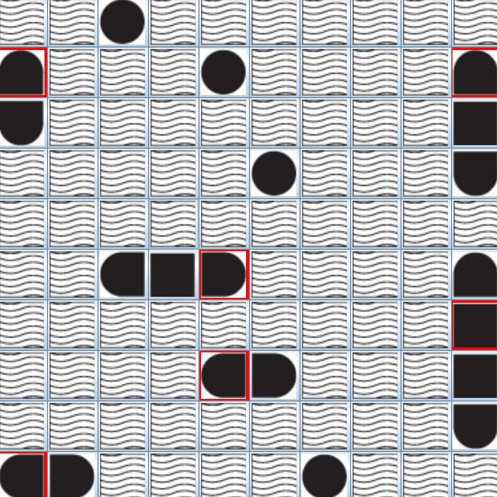
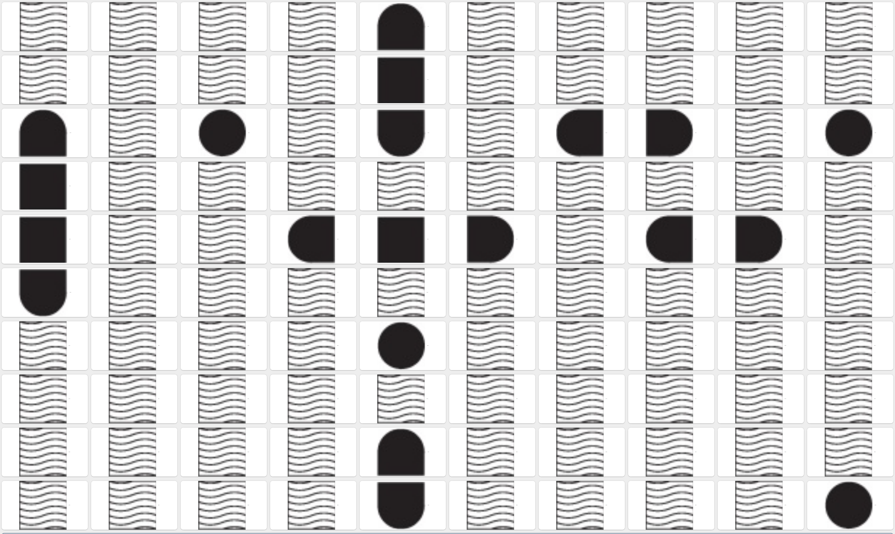
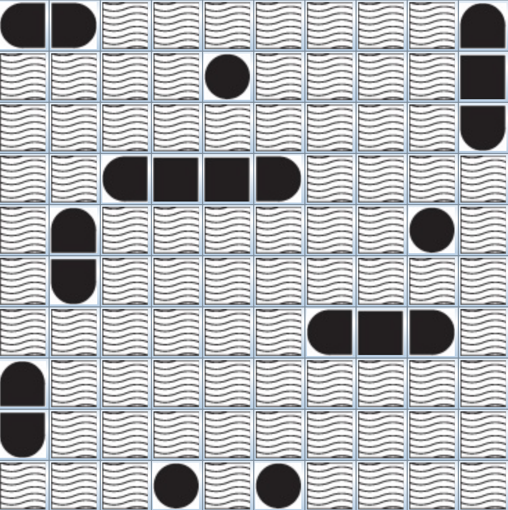

# Relazione progetto CLIPS

Andrea Cacioli
Matricola: 914501

## Sistema Esperto per la battaglia navale in solitario

In questo progetto é stato richiesto di scrivere un sistema esperto per la risoluzione del gioco della battaglia navale in **CLIPS**.

Il gioco si gioca su una scacchiera 9x9 e all'inizio sono noti dei fatti relativi al numero di posizioni occupate da una nave in una riga e in una colonna (fatti k-per-row k-per-column).

Inoltre in altre situazioni é possibile avere dei fatti noti a priori relativi alla posizione occupata da un pezzo di nave.

**Attenzione**: Il progetto é stato realizzato prima delle nuove versioni comunicate via mail che cambiavano l'environment. Pertanto sono presenti regole che asseriscono fatti relativi alle **misfire**.

### Strategia

La strategia del mio sistema é semplice:

1. Per prima cosa se si é certi che in qualche posizione ci sia un pezzo di nave, fare una guess in tale cella
2. Se si é certi che un pezzo di nave possa eventualmente avere un pezzo in due posizioni possibili ma non in tutte e due, allora si fa una fire in una delle due posizioni e se ho trovato il pezzo di nave, non si fa la fire anche sul secondo.
3. Se non si ricade in nessuna delle due categorie precedenti si fa una fire nel punto con maggiore probabilitá di contenere un pezzo di nave.
4. Se non si dispone piú di fire ma si dispone ancora di guess, allora si fa una guess su tutte le celle con piú alta probabilitá di contenere una nave.

### Fatti

I fatti (non ordinati) relativi al contenuto di una cella sono i seguenti e contengono le coordinate della cella di cui si parla:

- cell se una cella esiste
- guessed: se si é fatto un guess su una cella
- fired: se si é fatto un fire su una cella
- water: se si é certi che tale cella contenga acqua

### Strutture di controllo

Sono state pensate delle strutture di controllo gestite come delle code. In pratica quando si asserisce un fatto, questo viene automaticamente utilizzato per fare una guess o una fire.

Fatti:

- plausible-cell: Fatto che se asserito, il sistema fará una fire su tale cella
- guess-queue: Fatto che se asserito, il sistema fará una guess su tale cella
  
Regole:

- guess-from-queue: Regola con salience alta che esegue la guess
- information-already-used: se si é giá fatta una guess in tale cella, la si toglie dalla coda senza farne un'altra.
- fire-plausible-cell: esegue una fire sulla cella che potrebbe contenere una nave.
- clean-water: rimuove l'informazione relativa all'acqua se essa é fuori dalla scacchiera
- no-fire-on-fired: lo stesso di information-already-used ma per le fire

#### One Or The Other

Spesso capita che ci si trovi in delle situazioni in cui si é indecisi se la barca possa avere un pezzo in due posizioni, tuttavia si sa certamente che non puó avere entrambe le posizioni occupate.
In tale situazione si utilizza il fatto one-or-the-other che viene asserito insieme ai fatti plausible-cell che causeranno le fire.
Se una fire va a buon fine in una delle due celle, si rimuove sia il fatto one-or-the-other sia l'altra cella (che a questo punto non é piú plausibile).

### Probabilitá

**(KNOWN)** Siano $K_r$ e $K_c$ il conteggio delle celle che sono note contenere qualcosa rispettivamente nella riga $i$ e nella colonna $j$.

**(BOATS)** Siano $B_r$ e $B_c$ il conteggio delle celle che sono note contenere dei pezzi di barca rispettivamente nella riga $i$ e nella colonna $j$.

**(DISCOVERED)** Siano $D_r$ e $D_c$ il conteggio delle celle che sono giá state scoperte contenere dei pezzi di barca precedentemente dal programma rispettivamente nella riga $i$ e nella colonna $j$.

Posso calcolare la probabilitá usando la definizione classica (casi favorevoli / casi totali)
La probabilitá della cella $C_{i,j}$ di contenere una barca é la seguente:

$$
\bold{P}(C_{i,j} \neq \text{water}) = \frac{(B_r + B_C) - (D_r + D_c)}{19 - (K_r + K_c)}
$$

\pagebreak

#### Esempio

B = Barca nota
W = Acqua nota

| 0         | 1   | 2   | 3 (k = 3) | 4   | 5   | 6   | 7   | 8   | 9   |
| --------- | --- | --- | --------- | --- | --- | --- | --- | --- | --- |
| 0         |     |     |           |     |     |     |     |     |     |
| 1         |     |     |           |     |     |     |     |     |     |
| 2         |     |     | W         |     |     |     |     |     |     |
| 3         |     |     |           |     |     |     |     |     |     |
| 4         |     |     | B         |     |     |     |     |     |     |
| 5 (k = 3) |     |     | $C_{5,2}$ |     | B   |     | W   |     |     |
| 6         |     |     |           |     |     |     |     |     |     |
| 7         |     |     |           |     |     |     |     |     |     |
| 8         |     |     | W         |     |     |     |     |     |     |
| 9         |     |     |           |     |     |     |     |     |     |

In questo esempio abbiamo che la probabilitá di $C_{5,2}$ di contenere una barca é:

$$
\bold{P}(C_{5,2} \neq \text{water}) = \frac{(3 + 3) - (1 + 1)}{19 - (2 + 3)} = \frac{4}{14} = .2857 = 28.57\%
$$

Una volta determinata la probabilitá, se il sistema non ha altre informazioni note, esso procede a fare delle fire sulla cella piú probabile.

Se non dispone di fire, il sistema utilizza tutte le guess su ogni cella piú probabile.

### Performance

Evidenzio ora le prove che ho fatto: le scacchiere utilizzate e i relativi punteggi che il sistema esperto ha totalizzato su di esse.

Scacchiera 1 (mapEnvironment1.clp): **Punteggio 280**

Scacchiera 2 (NoInformation.clp): **Punteggio 245**

Scacchiera 3 (Scattered.clp): **Punteggio 20**

### Considerazioni

- Come si puó vedere la strategia é **molto buona se si dispongono informazioni sulla posizione delle barche**.
- Il meccanismo della probabilitá **funziona bene su mappe in cui molte celle di una stessa riga o colonna sono occupate da barche**.
- Utilizzare la probabilitá **non fa molti punti se le navi sono molto ben spaziate tra loro** perché i valori di k-per-row e k-per-column sono simili tra loro.
