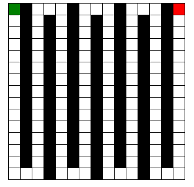

# Relazione progetti Prolog e Clingo

Andrea Cacioli
Matricola: 914501

[TOC]

## Prolog

In questa prima fase si é sperimentato l'utilizzo del paradigma di programmazione logica in prolog. Il progetto consiste nello sviluppo di un codice in grado di risolvere il problema del labirinto attraverso diverse strategie di ricerca nello spazio degli stati.

### File prodotti

#### File principali

- astar: file di definizione della strategia di ricerca informata A*
- azioni: file di definizione azioni possibili e applicabilitá di esse
- bfs: file di definizione strategia blind di ricerca in ampiezza
- heuristic: file di definizione di eventuali euristiche per la ricerca informata
- profonditá: file di definizione della strategia di ricerca blind in profonditá e iterative deepening.

#### Labirinti

- lab1.pl: file creato in classe di test 10x10
- zigzag15x15.pl: labirinto in figura

#### Utilizzo

Per far partire le seguenti strategie si carichi tramite consultazione il labirinto che si desidera testare e si proceda come segue:

1. Ricerca Iterative Deepening
    - Caricare i file ['profonditá.pl']
    - Dimostrare con prolog il fatto start.

2. Ricerca in profonditá
    - Caricare i file ['profonditá.pl']
    - asserire una profonditá massima n grande a piacere con assert(maxProf(n))
    - Dimostrare con prolog i fatti prova(Cammino), write(Cammino).

3. Ricerca in ampiezza
    - Caricare i file ['bfs.pl']
    - Dimostrare con prolog il fatto start.

4. Ricerca con A*
    - Caricare i file ['astar.pl']
    - Dimostrare con prolog il fatto start.
