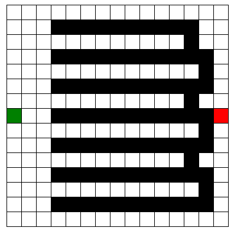
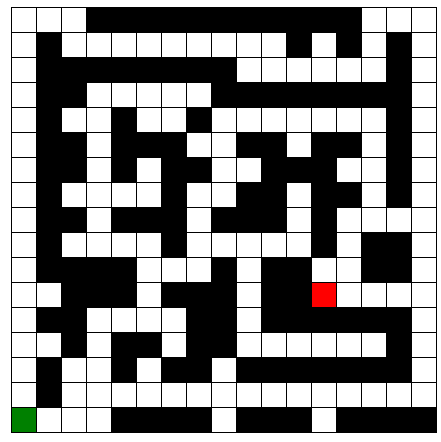
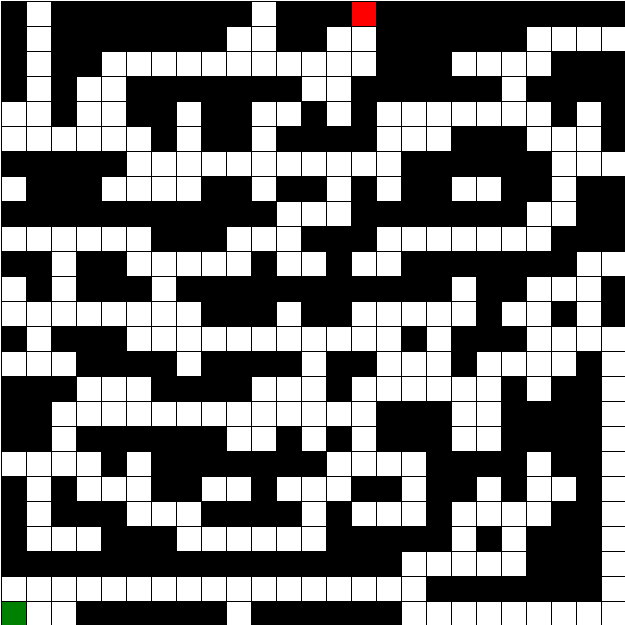

# Relazione progetti Prolog e Clingo

Andrea Cacioli
Matricola: 914501

[TOC]

## Prolog

In questa prima fase si é sperimentato l'utilizzo del paradigma di programmazione logica in prolog. Il progetto consiste nello sviluppo di un codice in grado di risolvere il problema del labirinto attraverso diverse strategie di ricerca nello spazio degli stati.

### File prodotti

#### File principali

- astar: file di definizione della strategia di ricerca informata A*
- azioni: file di definizione azioni possibili e applicabilitá di esse
- bfs: file di definizione strategia blind di ricerca in ampiezza
- heuristic: file di definizione di eventuali euristiche per la ricerca informata
- profonditá: file di definizione della strategia di ricerca blind in profonditá e iterative deepening.

#### Labirinti

- lab1.pl: file creato in classe di test 10x10
- zigzag15x15.pl: labirinto in figura

- hard20x20.pl: labirinto in figura

- hard15x15.pl: labirinto pensato per mandare in confusione A*

- easy17x17.pl: labirinto classico con molti blocchi

- easy25x25.pl: labirinto classico con molti blocchi

#### File Benchmarker

Tale file serve solamente a provare le varie strategie su un labirinto precedentemente specificato.

#### Utilizzo

Per far partire le seguenti strategie si carichi tramite consultazione il labirinto che si desidera testare e si proceda come segue:

1. Ricerca Iterative Deepening
    - Caricare i file ['prof.pl']
    - Dimostrare con prolog il fatto start.

2. Ricerca in profonditá
    - Caricare i file ['prof.pl']
    - asserire una profonditá massima n grande a piacere con assert(maxProf(n))
    - Dimostrare con prolog i fatti prova(Cammino), write(Cammino).

3. Ricerca in ampiezza
    - Caricare i file ['bfs.pl']
    - Dimostrare con prolog il fatto start.

4. Ricerca con A*
    - Caricare i file ['astar.pl']
    - Dimostrare con prolog il fatto start.

#### Performance

Tabella dei test effettuati:
I = Instantaneous (probably 10 to 20 milliseconds)

| Labirinto   | A*      | Ampiezza | Iterative Deepening (MaxProf) | Profonditá |
| ----------- | ------- | -------- | ----------------------------- | ---------- |
| lab1        | I       | I        | I (16)                        | I          |
| zigzag15x15 | I       | I        | I (126)                       | I          |
| easy17x17   | I       | I        | I (25)                        | I          |
| easy25x25   | I       | 390 ms   | 51.313 s (98)                 | 15 ms      |
| hard15x15   | I       | 47       | 22.297 s (28)                 | I          |
| hard20x20   | 1.906 s | 67.188 s | DNF (> 3h) (33)                     | 6.078 s    |

##### Osservazioni

- La strategia in profonditá é molto buona quando non deve trovare soluzioni ottime, infatti ha fatto molto bene in tutti i labirinti, tuttavia la lunghezza del cammino in hard20x20 era di ben 87 contro i 37 della strategia in ampiezza.
- Non sono riuscito a disegnare un labirinto che mettesse in difficoltá seriamente A*
- Iterative Deepening, sebbene trovi sempre la soluzione ottima in termini di numero di passi, é la piú lenta in termini di tempo di esecuzione.
- In generale i labirinti con pochi muri risultano piú dispendiosi da calcolare per le strategie che trovano una soluzione ottima, eccetto A* grazie alla sua euristica.
- Labirinti che all'apparenza sembrano molto difficili da risolvere per noi esseri umani sono in realtá molto piú semplici per la macchina perché diminuiamo il branching factor dell'albero di ricerca nello spazio degli stati.
